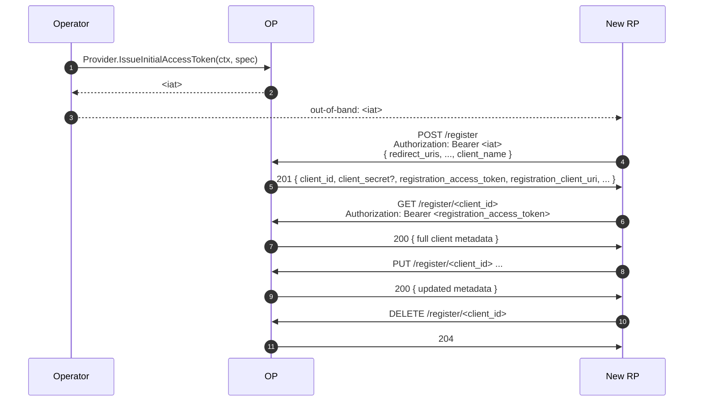

# Use case — Dynamic Client Registration

## What is Dynamic Client Registration?

In the simplest setup, you (the OP operator) hand-register every RP
that integrates with your OP — adding their `client_id`,
`client_secret`, redirect URIs, and scopes to your config. This is
fine for a handful of internal apps; it doesn't scale to a public
ecosystem where dozens of partners want to integrate weekly.

**Dynamic Client Registration (DCR)** is a JSON API that lets RPs
register themselves at runtime — they POST their metadata, the OP
returns a fresh `client_id` and credentials. To prevent abuse, the OP
gates registration with an **Initial Access Token (IAT)** the operator
mints out-of-band; you can scope IATs by allowed metadata, expiry, and
single-use.

::: details Specs referenced on this page
- [RFC 7591](https://datatracker.ietf.org/doc/html/rfc7591) — Dynamic Client Registration Protocol
- [RFC 7592](https://datatracker.ietf.org/doc/html/rfc7592) — Dynamic Client Registration Management (read / update / delete)
- [RFC 8414](https://datatracker.ietf.org/doc/html/rfc8414) — Authorization Server Metadata (discovery)
- [RFC 8252](https://datatracker.ietf.org/doc/html/rfc8252) — OAuth 2.0 for Native Apps (loopback redirect rules referenced below)
- [OpenID Connect Core 1.0](https://openid.net/specs/openid-connect-core-1_0.html) — §2 (`auth_time` / `acr` / `default_max_age`)
:::

::: details Quick refresher
- **Initial Access Token (IAT)** — a short-lived bearer token the
  operator mints out-of-band and hands to a registering RP. The OP
  refuses `POST /register` without it; it's the gate that prevents
  any anonymous caller from creating clients.
- **Registration Access Token (RAT)** — returned to the RP in the 201
  response alongside the new `client_id`. The RP uses the RAT (against
  `registration_client_uri`) for the RFC 7592 read / update / delete
  operations on its own registration.
:::

> **Source:** [`examples/41-dynamic-registration`](https://github.com/libraz/go-oidc-provider/tree/main/examples/41-dynamic-registration)

## Architecture



## Wiring

```go
import (
  "github.com/libraz/go-oidc-provider/op"
)

provider, err := op.New(
  /* required options */
  op.WithDynamicRegistration(op.RegistrationOption{
    AllowedGrantTypes:    []string{"authorization_code", "refresh_token"},
    AllowedResponseTypes: []string{"code"},
  }),
)

// Mint an Initial Access Token operationally — pass to the RP out-of-band.
iat, err := provider.IssueInitialAccessToken(ctx, op.InitialAccessTokenSpec{
  TTL:     24 * time.Hour,
  MaxUses: 1,
})
```

`op.WithDynamicRegistration` implicitly activates `feature.DynamicRegistration`,
mounts `/register`, and surfaces `registration_endpoint` in the discovery
document.

## Authentication-context client metadata

Three client-metadata fields shape `/authorize` defaults and the
`auth_time` claim of the resulting `id_token`. They are accepted both
from DCR registration (RFC 7591) and from `op.ClientSeed` static
seeds; the OP enforces them at request time.

| Field | Effect | Spec |
|---|---|---|
| `default_max_age` (nullable integer) | When a request omits `max_age`, the OP applies this value as the default. The field is nullable end-to-end so absent and explicit `0` (force re-auth) remain distinguishable on the wire and in storage. | OIDC Core 1.0 §2 / Dynamic Client Registration §2 |
| `default_acr_values` | When a request omits `acr_values`, the OP applies these as the default ACR target. Combine with `op.WithACRPolicy` (see [MFA / step-up](/use-cases/mfa-step-up)) to map to the AAL ladder. | OIDC Core 1.0 §2 / Dynamic Client Registration §2 |
| `require_auth_time` | When `true`, the issued `id_token` must carry `auth_time`. If the OP cannot recover the originating authentication time, token issuance fails with `server_error` rather than fabricating a value. | OIDC Core 1.0 §2 |

::: tip Why server_error on missing auth_time
RFC violations of `require_auth_time` are rare in practice — the OP
records `auth_time` whenever it runs the login flow itself. The
fabrication path (substituting `iat`, for example) would silently
break RPs that audit step-up assurance based on `auth_time`. The
constructor-time refusal makes the gap visible at the point that
caused it.
:::

## Safety floors that are not negotiable

::: warning Loopback `redirect_uris` and DNS rebinding
The default `application_type` is `web`. Web clients may register an
`http` `redirect_uri` only when the host is the **IP literal**
`127.0.0.1` or `[::1]`; the textual `localhost` is rejected by
default to close the RFC 8252 §8.3 DNS-rebinding window. Web clients
that legitimately bind to `localhost` opt in via
`op.WithAllowLocalhostLoopback()` so the deviation from the safe
default is visible in the configuration site.

Native clients (`application_type=native`) follow OIDC Registration
§2 and additionally accept all three loopback hosts
(`127.0.0.1` / `[::1]` / `localhost`) over `http` without an opt-in,
plus `https` (claimed) and reverse-DNS custom URI schemes
(e.g. `com.example.app:/callback`) per RFC 8252 §7.1. Custom schemes
that lack a `.` are rejected because non-reverse-DNS schemes collide
across applications.
:::

## What registration enforces today

The DCR surface is `partial` rather than `full`, but the partial
label captures intentional design choices, not TBDs. The validator
rejects metadata that violates any of the rules below at
`POST /register` and at `PUT /register/{client_id}`:

- `redirect_uris` shape per `application_type` (see the warning
  above), with no fragments and absolute URLs only.
- `grant_types` and `response_types` are cross-checked against the
  OIDC Core §3 / OIDC Registration §2 combination table; an
  inconsistent pair is rejected with `invalid_client_metadata`
  rather than silently auto-fixed.
- `jwks` and `jwks_uri` are mutually exclusive; URI-bearing metadata
  fields (`client_uri`, `logo_uri`, `policy_uri`, `tos_uri`,
  `jwks_uri`, `sector_identifier_uri`, `initiate_login_uri`,
  `request_uris`) must be absolute, `https`, and fragment-free.
- `sector_identifier_uri` is fetched at registration time and the
  document MUST be a JSON array of strings that contains every
  registered `redirect_uri` (OIDC Core §8.1). The fetch is bounded
  to a 5 s timeout and a 5 MiB body; failure or containment
  mismatch produces `invalid_client_metadata`.
- `subject_type=pairwise` without `sector_identifier_uri` requires
  every `redirect_uri` host to match.
- `request_object_signing_alg` is restricted to `RS256` / `PS256` /
  `ES256` / `EdDSA`.

## Intentional limits

The remaining gap to a `full` claim is design choice, not pending
work. The reasoning behind each is documented as a separate entry on
[design judgments](/security/design-judgments) — `client_secret`
non-disclosure ([#dj-20](/security/design-judgments#dj-20)), PUT
omission semantics ([#dj-21](/security/design-judgments#dj-21)), and
the `sector_identifier_uri` fetch / native loopback rules
([#dj-22](/security/design-judgments#dj-22)).

- **`client_secret` is not re-emitted on `GET /register/{id}`.** The
  store keeps a hash; the plaintext exists in the response only on
  the original `POST /register` and on the two PUT cases below.
  RFC 7591 §3.2.1 makes the field optional in the read response.
- **PUT omission resets to server defaults, not deletion.** A
  `PUT /register/{client_id}` that omits `grant_types`,
  `response_types`, `token_endpoint_auth_method`, `application_type`,
  `subject_type`, or `id_token_signed_response_alg` reapplies the OP
  default for that field; optional metadata (`client_uri`,
  `logo_uri`, `policy_uri`, `tos_uri`, …) becomes empty.
- **PUT only re-emits `client_secret` on (a) `none` → confidential
  auth-method upgrade or (b) explicit rotation request.** The body
  of a routine metadata edit does not include the secret.
- **PUT body MUST NOT include server-managed fields.**
  `registration_access_token`, `registration_client_uri`,
  `client_secret_expires_at`, and `client_id_issued_at` cause
  `400 invalid_request`. A `client_secret` value that does not match
  the authenticated client also returns `400`.
- **`software_statement` (RFC 7591 §2.3) is not accepted in v1.0.**
  A request that includes the field returns
  `invalid_software_statement`. Federation / trust-chain support is
  out of scope for v1.0.

## Read / update / delete

The 201 response includes a `registration_access_token` and
`registration_client_uri`. RPs call those for RFC 7592 operations:

```sh
# read
curl -H "Authorization: Bearer $RAT" $RCU

# update
curl -X PUT -H "Authorization: Bearer $RAT" -H "Content-Type: application/json" \
  -d '{"client_name":"New Name", ...}' $RCU

# delete
curl -X DELETE -H "Authorization: Bearer $RAT" $RCU
```

## When to use it

DCR shines when:

- You're building a multi-tenant SaaS where each tenant brings their own
  RP and you don't want to stage config rolls.
- You're operating an internal developer platform where teams self-serve
  client credentials.

DCR is overkill (and an attack surface you don't need) when:

- You have ten RPs, all internal, all known. `op.WithStaticClients(...)`
  is simpler and gives you fewer moving parts.
