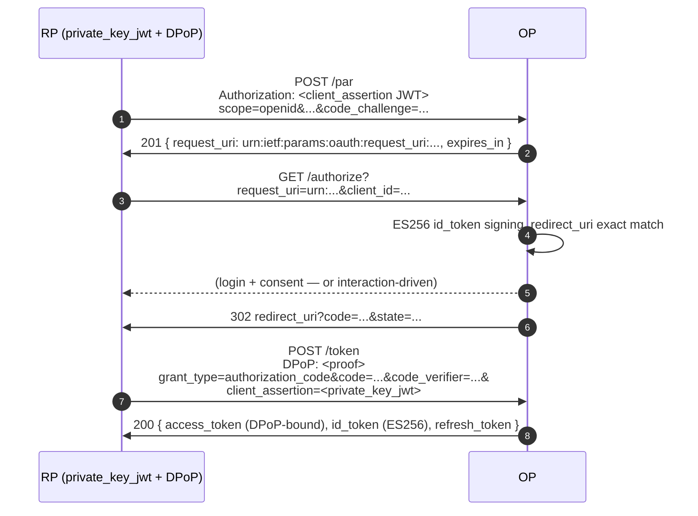

# Use case — FAPI 2.0 Baseline

## What is FAPI 2.0?

**FAPI** ("Financial-grade API") is a profile of OAuth 2.0 + OIDC maintained by the OpenID Foundation. It picks a **strict subset** of the underlying specs and forbids the optional flexibility that attackers historically abused — for example, FAPI rejects `RS256` signatures in favour of `ES256`/`PS256`, requires PKCE on every authorization, mandates sender-constrained tokens (DPoP **or** mTLS), and forces RPs to send their authorize requests through PAR + JAR instead of as plain query strings (this library signs id_tokens with `ES256` only, so the anti-`RS256` clause is satisfied by construction).

The bar exists because banking, healthcare, and government deployments need a profile that can be audited against a checklist instead of "did you remember to set every flag?". FAPI 2.0 supersedes FAPI 1.0 (which is still in use). FAPI 2.0 Baseline is the entry-level profile; FAPI 2.0 Message Signing adds JARM + DPoP nonce + RS-side proof signing.

This library exposes Baseline as a **single profile switch** (`op.WithProfile(profile.FAPI2Baseline)`) that flips every required flag and refuses to start in any combination that would silently violate the profile.

A primer with each acronym (PAR, JAR, JARM, DPoP, mTLS, ES256) walked through is at [FAPI 2.0 primer](/concepts/fapi). This page covers the wiring.

::: details Specs referenced on this page
- [FAPI 2.0 Baseline](https://openid.net/specs/fapi-2_0-baseline.html) — Final
- [RFC 9126](https://datatracker.ietf.org/doc/html/rfc9126) — Pushed Authorization Requests (PAR)
- [RFC 9101](https://datatracker.ietf.org/doc/html/rfc9101) — JWT-Secured Authorization Request (JAR)
- [RFC 7636](https://datatracker.ietf.org/doc/html/rfc7636) — PKCE
- [RFC 9449](https://datatracker.ietf.org/doc/html/rfc9449) — DPoP
- [RFC 8705](https://datatracker.ietf.org/doc/html/rfc8705) — Mutual-TLS Client Authentication
- [RFC 7518](https://datatracker.ietf.org/doc/html/rfc7518) — JOSE algorithms
:::

> **Source:** [`examples/03-fapi2/main.go`](https://github.com/libraz/go-oidc-provider/tree/main/examples/03-fapi2)

## What FAPI 2.0 Baseline mandates

| Requirement | RFC | Library behaviour |
|---|---|---|
| Pushed Authorization Requests | RFC 9126 | `feature.PAR` auto-enabled by the profile. `request_uri` returned from `/par` is the only authorize entry. |
| Proof Key for Code Exchange | RFC 7636 | `code_challenge_method=S256` required; `plain` rejected. |
| Sender-constrained tokens (DPoP **or** mTLS) | RFC 9449 / RFC 8705 | Profile flags `RequiredAnyOf=[DPoP, MTLS]`; if neither is configured, the constructor auto-selects DPoP as the no-infrastructure default. |
| ES256 signing | RFC 7518 | `id_token_signing_alg_values_supported` is `["ES256"]` unconditionally; `RS256` / `none` / HS* never advertised. |
| `redirect_uri` exact match | FAPI 2.0 §5.3 | No wildcards. Byte-identical comparison. |
| `private_key_jwt` or mTLS client auth | FAPI 2.0 §3.1.3 | Token endpoint auth-method list intersected with FAPI allow-list. |

## Architecture



## Code (excerpts from [`examples/03-fapi2`](https://github.com/libraz/go-oidc-provider/tree/main/examples/03-fapi2))

```go
import (
  "github.com/libraz/go-oidc-provider/op"
  "github.com/libraz/go-oidc-provider/op/profile"
  "github.com/libraz/go-oidc-provider/op/storeadapter/inmem"
)

const (
  demoIssuer      = "https://op.example.com"
  demoClientID    = "fapi2-example-client"
  demoRedirectURI = "https://rp.example.com/callback"
)

provider, err := op.New(
  op.WithIssuer(demoIssuer),
  op.WithStore(inmem.New()),
  op.WithKeyset(opKeys.Keyset()),
  op.WithCookieKeys(opKeys.CookieKey),
  op.WithProfile(profile.FAPI2Baseline), // <--- the profile switch
  op.WithStaticClients(op.PrivateKeyJWTClient{
    ID:            demoClientID,
    JWKS:          clientJWKs, // public JWK Set as JSON bytes
    RedirectURIs:  []string{demoRedirectURI},
    Scopes:        []string{"openid", "profile", "email"},
    GrantTypes:    []string{"authorization_code", "refresh_token"},
    ResponseTypes: []string{"code"},
  }),
)
```

`PrivateKeyJWTClient` is the typed seed for FAPI clients — it forces `token_endpoint_auth_method=private_key_jwt` automatically, so the embedder never has to spell that field out. The companion typed seeds are `op.PublicClient` and `op.ConfidentialClient`; all three implement `op.ClientSeed` and feed `WithStaticClients(seeds ...ClientSeed)`.

The `WithProfile` call:

1. Enables `feature.PAR` and `feature.JAR` automatically.
2. Intersects `token_endpoint_auth_methods_supported` with the FAPI 2.0 §3.1.3 allow-list (`private_key_jwt`, `tls_client_auth`, `self_signed_tls_client_auth`).
3. Keeps `id_token_signing_alg_values_supported = ["ES256"]` (the OP only ever advertises and signs `ES256` id_tokens; FAPI 2.0's anti-`RS256` clause is satisfied by construction).
4. Forces `redirect_uri` exact match (no wildcards anywhere).
5. Satisfies the DPoP-or-mTLS sender-constraint requirement by preserving an explicit `feature.MTLS` opt-in when present, or by adding `feature.DPoP` when neither binding was selected.

::: tip mTLS instead of DPoP
The profile's default sender binding is DPoP because it needs no TLS client-certificate plumbing. If your deployment standardizes on mTLS, enable `feature.MTLS` explicitly and configure `op.WithMTLSProxy(...)` for a TLS-terminating proxy; that explicit choice suppresses the DPoP default. See [`examples/50-fapi-tls-jwks`](https://github.com/libraz/go-oidc-provider/tree/main/examples/50-fapi-tls-jwks) for FAPI-grade TLS helpers.
:::

## Verifying the surface

```sh
curl -s http://localhost:8080/.well-known/openid-configuration | jq '{
  pushed_authorization_request_endpoint,
  request_parameter_supported,
  dpop_signing_alg_values_supported,
  token_endpoint_auth_methods_supported,
  id_token_signing_alg_values_supported
}'
```

Expected:

```json
{
  "pushed_authorization_request_endpoint": "http://localhost:8080/oidc/par",
  "request_parameter_supported": true,
  "dpop_signing_alg_values_supported": ["ES256", "EdDSA", "PS256"],
  "token_endpoint_auth_methods_supported": ["private_key_jwt"],
  "id_token_signing_alg_values_supported": ["ES256"]
}
```

The library publishes `["ES256"]` for `id_token_signing_alg_values_supported` regardless of profile (every issued id_token is signed `ES256`); the FAPI 2.0 §6.2.1 mandate against `RS256` is satisfied because `RS256` never appears on the OP's supported set in the first place. `dpop_signing_alg_values_supported` covers DPoP proof acceptance and is `["ES256", "EdDSA", "PS256"]`.

## Conformance

The OFCS [`fapi2-security-profile-id2-test-plan`](/compliance/ofcs) exercises this exact wiring: 48 PASSED / 9 REVIEW (manual reviewer) / 1 SKIPPED (RSA-key negative test that needs an additional client key) / **0 FAILED** in the latest baseline.

For the full OFCS picture and the REVIEW / SKIPPED breakdown, see [OFCS conformance status](/compliance/ofcs).
