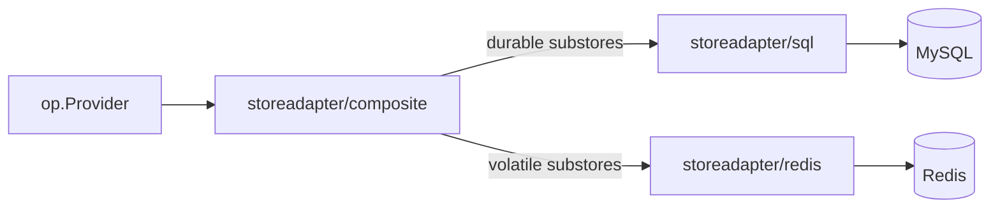

# Use case — Hot/cold split (Redis volatile)

## What does "hot/cold" mean here?

OPs hold two very different shapes of state:

- **Cold (durable)** — long-lived rows you cannot afford to lose:
  registered clients, user records, refresh-token chains, persistent
  sessions.
- **Hot (volatile)** — short-lived rows with high churn that are
  acceptable to lose: in-flight `request_uri` from PAR (RFC 9126),
  consumed JTI replay set (RFC 7519), interaction state for
  half-completed logins.

Putting both in the same backend is wasteful: durable storage doesn't
need the QPS the volatile state generates, and volatile storage doesn't
need the durability guarantees the cold state requires. The composite
adapter lets you split them.

::: details Specs referenced on this page
- [RFC 9126](https://datatracker.ietf.org/doc/html/rfc9126) — Pushed Authorization Requests (PAR — `request_uri` is volatile state)
- [RFC 7519](https://datatracker.ietf.org/doc/html/rfc7519) — JWT, including `jti` (replay-set state)
- [RFC 9700](https://datatracker.ietf.org/doc/html/rfc9700) — OAuth 2.0 Security BCP, §4.14 (refresh-token rotation)
- [OpenID Connect RP-Initiated Logout 1.0](https://openid.net/specs/openid-connect-rpinitiated-1_0.html) — session state
- [OpenID Connect Back-Channel Logout 1.0](https://openid.net/specs/openid-connect-backchannel-1_0.html) — fan-out at logout time
:::

::: details Vocabulary refresher
- **Durability posture** — Whether a substore *must* survive process restart and replica fail-over. Refresh-token chains, registered clients, and durable sessions are durable; PAR `request_uri`, JTI replay set, and in-flight interaction state are acceptable to lose. The split is not aesthetic — durable storage doesn't need volatile-tier QPS, and volatile storage doesn't need durable-tier guarantees.
- **Transactional cluster** — A group of substores that must commit atomically together (e.g. issuing an `auth_code` and the corresponding refresh-token chain). Splitting them across backends would risk a half-committed state where one row is durable and the other isn't. The composite constructor refuses configurations that would split a cluster.
- **`jti`** — A unique JWT identifier (RFC 7519). The OP keeps a "consumed JTI" set per JWT-bearing surface (request objects, client assertions, DPoP proofs) to prevent replay. The set is ephemeral — short TTLs match each spec's reuse window — so volatile storage is the natural fit.
:::

`op/storeadapter/composite` is the splitter. It accepts a "durable"
store and a "volatile" store, routes each substore to the appropriate
side, and refuses configurations that would break a transactional
cluster (substores that must commit atomically together).

> **Sources:**
> - [`examples/08-composite-hot-cold`](https://github.com/libraz/go-oidc-provider/tree/main/examples/08-composite-hot-cold) — SQLite durable + inmem volatile, runs as a single `go run -tags example .` invocation.
> - [`examples/09-redis-volatile`](https://github.com/libraz/go-oidc-provider/tree/main/examples/09-redis-volatile) — MySQL durable + Redis volatile, shipped as a docker-compose stack pinned to `mysql:8.4` and `redis:7.4-alpine` so adapter contract tests and the example share one engine matrix.

## Architecture



The composite store enforces a transactional-cluster invariant: substores
that need to commit atomically together (e.g. `AuthCodeStore` and
`RefreshTokenStore`) **must** be on the same backend. The composite
constructor refuses configurations that would split a transactional
cluster.

## Code

```go
import (
  "context"

  "github.com/libraz/go-oidc-provider/op"
  "github.com/libraz/go-oidc-provider/op/storeadapter/composite"
  oidcredis "github.com/libraz/go-oidc-provider/op/storeadapter/redis"
  oidcsql "github.com/libraz/go-oidc-provider/op/storeadapter/sql"
)

durable, err := oidcsql.New(db, oidcsql.MySQL())
if err != nil { /* ... */ }

volatile, err := oidcredis.New(context.Background(),
  oidcredis.WithDSN("rediss://redis:6380/0"), // TLS required by default
  oidcredis.WithRedisAuth(redisUsername, redisPassword),
)
if err != nil { /* ... */ }

// composite.New takes functional options. WithDefault routes every
// Kind to the durable backend; With(kind, store) overrides the named
// substore. composite.New rejects configurations that would split a
// transactional cluster (composite.TxClusterKinds) across backends.
combined, err := composite.New(
  composite.WithDefault(durable),
  composite.With(composite.Sessions, volatile),
  composite.With(composite.Interactions, volatile),
  composite.With(composite.ConsumedJTIs, volatile),
)
if err != nil { /* ... */ }

provider, err := op.New(
  op.WithIssuer("https://op.example.com"),
  op.WithStore(combined),
  op.WithKeyset(myKeyset),
  op.WithCookieKey(myCookieKey),
  op.WithStaticClients(op.PublicClient{
    ID:           "demo-rp",
    RedirectURIs: []string{"https://rp.example.com/callback"},
    Scopes:       []string{"openid", "profile"},
  }),
)
```

::: info Static client seeding through composite
`op.WithStaticClients` accepts a `*composite.Store` directly. The
composite deliberately does **not** satisfy `store.ClientRegistry`
through a type assertion (a read-only routed `Clients` backend would
otherwise be silently coerced into a registry); instead it exposes an
optional `ClientRegistry()` accessor that `op.WithStaticClients`
probes at wiring time. Embedders therefore do not need to seed
against the durable backend before wrapping it in a composite. If
the routed `Clients` backend is read-only the probe returns
`(nil, false)` and `op.New` rejects the configuration with the same
`store.ClientRegistry required` error a directly-supplied read-only
store would produce.
:::

## Redis safety floor

::: warning No plaintext Redis by default
`redis.New` **refuses to start** without TLS (`rediss://`) and AUTH.
The library does not let you ship a setup that flies your refresh-token
chain across the wire in plaintext. The escape hatch
`redis.WithDevModeAllowPlaintext(callback)` exists for `examples/`
runs and local development; using it in production is a security
regression you have to type out by hand.
:::

## What goes where (default split)

| Substore | Tier |
|---|---|
| `ClientStore` | durable (SQL) |
| `UserStore` | durable (SQL) |
| `AuthCodeStore` | durable (SQL — short-lived but in transactional cluster) |
| `RefreshTokenStore` | durable (SQL) |
| `AccessTokenRegistry` | durable (SQL — populated only under `RevocationStrategyJTIRegistry`) |
| `OpaqueAccessTokenStore` | durable (SQL — populated only when opaque AT format is configured) |
| `GrantRevocationStore` | durable (SQL — backs the default grant-tombstone revocation) |
| `SessionStore` | durable (SQL) by default; opt into volatile via `WithSessionDurabilityPosture` |
| `InteractionStore` | volatile (Redis) |
| `ConsumedJTIStore` | volatile (Redis) |
| `PARStore` | volatile (Redis) |

::: info Why the new substores stay on the durable side
`OpaqueAccessTokenStore` and `GrantRevocationStore` are part of the
transactional cluster: their writes commit atomically with the grant
or refresh-token write that triggered them. The Redis adapter returns
`nil` from both accessors so the composite splitter cannot route them
to a non-transactional backend; embedders who need either substore
configure SQL on the durable side. A Redis-only deployment that never
enables opaque AT and never needs server-side JWT revocation can leave
both as `nil`.
:::

::: details Why SessionStore can be either
A volatile session store (eviction under memory pressure, no replication
guarantees) is acceptable for many deployments — the worst case is a
user re-authenticating. Some embedders want stronger guarantees so they
can audit log-in state through restarts. The library exposes the choice
via `op.WithSessionDurabilityPosture(SessionDurabilityVolatile |
SessionDurabilityDurable)` and propagates the value into back-channel
logout audit events so SOC dashboards distinguish "expected gap under
volatile placement" from "unexpected gap under durable placement."
:::

## Observability

The volatile-tier hit rate, cache evictions, and SQL pool stats are best
exposed via the metrics each backend ships natively (`redis_*` exporter,
your SQL pool's metrics) — the OP does not duplicate them. The OP emits
*business* counters (token issuance, refresh rotation, audit events) on
the registry you pass to `op.WithPrometheus`.
