# Use case — MFA / step-up

The library's authentication layer is built from three primitives that
compose:

- **`Authenticator`** — knows how to verify one factor (password, TOTP,
  passkey, email-OTP, …).
- **`Rule`** — decides whether a factor is **required** for this attempt.
- **`LoginFlow`** — the ordered list of `(authenticator, rule)` pairs.

Each authenticator runs only when its rule says yes. So "password
always, TOTP always" is one flow; "password always, captcha after 3
failures, TOTP if risk score is high" is another.

::: details Specs referenced on this page
- [RFC 6238](https://datatracker.ietf.org/doc/html/rfc6238) — TOTP (Time-Based One-Time Password)
- [RFC 8176](https://datatracker.ietf.org/doc/html/rfc8176) — Authentication Method Reference Values (`amr`)
- [RFC 9470](https://datatracker.ietf.org/doc/html/rfc9470) — OAuth 2.0 Step-up Authentication Challenge
- [WebAuthn Level 3](https://www.w3.org/TR/webauthn-3/) — Passkeys
- [NIST SP 800-63B](https://pages.nist.gov/800-63-3/sp800-63b.html) — Authenticator Assurance Levels (AAL)
- [OpenID Connect Core 1.0](https://openid.net/specs/openid-connect-core-1_0.html) — §2 (`acr`, `amr`, `auth_time`)
:::

::: details Vocabulary refresher
- **MFA** — Multi-Factor Authentication. The user proves more than one
  factor (something they know / have / are) before the OP issues
  tokens.
- **Step-up** — when an RP needs higher assurance for a sensitive
  operation, it asks for `acr_values=aalN`. If the current session is
  below that, the OP runs an additional factor before issuing a
  freshly-elevated `id_token`. Defined by RFC 9470.
- **AAL (Authenticator Assurance Level)** — NIST's three-tier ladder:
  AAL1 ≈ password, AAL2 ≈ password + something, AAL3 ≈ hardware-backed
  proof-of-possession. Many OPs and RPs use these labels in `acr`.
- **`amr` claim** — RFC 8176 enumerates standard reference values
  (`pwd`, `otp`, `mfa`, `hwk`, `face`, `fpt`, …) so RPs can audit which
  factors actually ran.
:::

> **Sources:**
> - [`examples/20-mfa-totp`](https://github.com/libraz/go-oidc-provider/tree/main/examples/20-mfa-totp) — password + always-TOTP.
> - [`examples/21-risk-based-mfa`](https://github.com/libraz/go-oidc-provider/tree/main/examples/21-risk-based-mfa) — risk-driven step-up.
> - [`examples/22-login-captcha`](https://github.com/libraz/go-oidc-provider/tree/main/examples/22-login-captcha) — captcha after N failed attempts.
> - [`examples/23-step-up`](https://github.com/libraz/go-oidc-provider/tree/main/examples/23-step-up) — RFC 9470 ACR step-up.

## Composition

```mermaid
flowchart TB
  S[Login start] --> P[Primary: PrimaryPassword]
  P --> R{Rules eval}
  R -->|RuleAlways| T[StepTOTP]
  R -->|RuleAfterFailedAttempts > 2| C[StepCaptcha]
  R -->|RuleRisk = high| WK[Stepped passkey]
  R -->|RuleACR &gt;= aal3| SU[Step-up factor]
  T --> Done[Issue tokens]
  C --> Done
  WK --> Done
  SU --> Done
```



`LoginFlow` is a struct with a `Primary` step and a list of `Rules`.
Each rule is a `Rule` value built from a constructor like
`op.RuleAlways(step)`, `op.RuleAfterFailedAttempts(n, step)`,
`op.RuleRisk(threshold, step)`, or `op.RuleACR(acr, step)`.

## Always TOTP

```go
import (
  "github.com/libraz/go-oidc-provider/op"
)

flow := op.LoginFlow{
  Primary: op.PrimaryPassword{Store: st.UserPasswords()},
  Rules: []op.Rule{
    op.RuleAlways(op.StepTOTP{
      Store:         st.TOTPs(),
      EncryptionKey: keys.TOTPKey,
    }),
  },
}

op.New(
  /* ... */
  op.WithLoginFlow(flow),
)
```

## Captcha after N failed attempts

```go
flow := op.LoginFlow{
  Primary: op.PrimaryPassword{Store: st.UserPasswords()},
  Rules: []op.Rule{
    op.RuleAfterFailedAttempts(3, op.StepCaptcha{Verifier: myCaptchaVerifier}),
  },
}

op.New(
  /* ... */
  op.WithLoginFlow(flow),
  op.WithCaptchaVerifier(myCaptchaVerifier), // hCaptcha / Turnstile / etc.
)
```

The `LoginAttemptObserver` (passed via `op.WithLoginAttemptObserver`)
counts failures per identifier. `RuleAfterFailedAttempts` reads that count.

## Risk-based step-up

```go
flow := op.LoginFlow{
  Primary: op.PrimaryPassword{Store: st.UserPasswords()},
  Rules: []op.Rule{
    op.RuleRisk(op.RiskScoreHigh, op.StepTOTP{Store: st.TOTPs(), EncryptionKey: keys.TOTPKey}),
  },
  Risk: myRiskAssessor, // RiskAssessor field on LoginFlow
}

op.New(
  /* ... */
  op.WithLoginFlow(flow),
)
```

The `RiskAssessor` returns a `RiskScore` per attempt. The library exposes
the four-level enum (`RiskScoreLow`, `RiskScoreMedium`, `RiskScoreHigh`,
`RiskScoreCritical`); your assessor translates whatever your provider
returns onto it.

## RFC 9470 ACR step-up

When the RP requests a higher Authentication Context Class
(`acr_values=aal3`), the OP runs the step-up factor regardless of
session state:

```go
flow := op.LoginFlow{
  Primary: op.PrimaryPassword{Store: st.UserPasswords()},
  Rules: []op.Rule{
    op.RuleACR("aal3", op.StepTOTP{Store: st.TOTPs(), EncryptionKey: keys.TOTPKey}),
  },
}

op.New(
  /* ... */
  op.WithLoginFlow(flow),
  op.WithACRPolicy(myACRPolicy), // op.ACRPolicy implementation
)
```

If the user already authenticated at `aal2` earlier in the session, the
RP requesting `acr_values=aal3` triggers an interactive step-up: the OP
runs `passkeyAuth` to lift the session to `aal3` before redirecting back.

## Audit trail

Each authenticator step emits a structured event from the
`op.Audit*` catalog — `op.AuditLoginSuccess` / `op.AuditLoginFailed`,
`op.AuditMFARequired` / `op.AuditMFASuccess` / `op.AuditMFAFailed`,
`op.AuditStepUpRequired` / `op.AuditStepUpSuccess`. Each event records:

- `factor` (`pwd`, `otp`, `webauthn`, …)
- `aal` (the AAL level reached)
- `acr` (the ACR class value)
- `amr` (RFC 8176 method references)

The events thread through `op.WithAuditLogger` (a `*slog.Logger`).

## Where authenticators come from

The library ships ready-to-use steps for the common factors:

| Step | What it verifies | Storage interface |
|---|---|---|
| `op.PrimaryPassword` | Username / email + password | `store.UserPasswords()` |
| `op.PrimaryPasskey` | WebAuthn / passkey as the primary factor | `store.Passkeys()` |
| `op.StepTOTP` | RFC 6238 TOTP, AES-256-GCM at-rest secret encryption | `store.TOTPs()` |
| `op.StepEmailOTP` | Email-delivered one-time code | `store.EmailOTPs()` |
| `op.StepRecoveryCode` | Single-use recovery codes | `store.RecoveryCodes()` |
| `op.StepCaptcha` | hCaptcha / Turnstile / your verifier | n/a |

The **storage** behind each step is yours — the library never owns
user records or password hashes. The reference `inmem` adapter is
fine for examples and tests; in production you implement the
`op/store/*` substores against your existing user table.

For a fully custom factor, implement `op.ExternalStep` (see
`op/step.go` godoc) and add it to the rule list with a unique
`KindLabel`. This is the pattern across every `examples/2x-*`.
