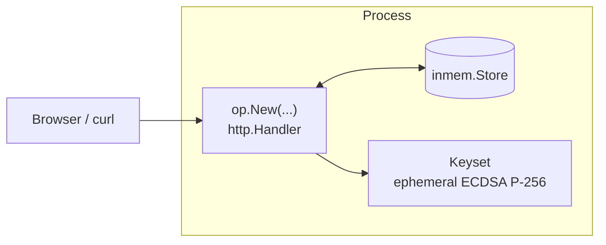

# Use case — Minimal OP

You want an OP up *just* to inspect discovery, JWKS, and basic flows. No
clients yet, no storage migration, no FAPI. Smallest possible boilerplate.

> **Source:** [`examples/01-minimal/main.go`](https://github.com/libraz/go-oidc-provider/tree/main/examples/01-minimal)

## Architecture



The library is one process. The store is in-memory. Keys are generated at
boot.

## Code

```go
package main

import (
  "log"
  "net/http"

  "github.com/libraz/go-oidc-provider/op"
  "github.com/libraz/go-oidc-provider/op/storeadapter/inmem"
)

func main() {
  keys := /* devkeys.MustEphemeral("minimal-1") in the example */

  provider, err := op.New(
    op.WithIssuer("https://op.example.com"),
    op.WithStore(inmem.New()),
    op.WithKeyset(keys.Keyset()),
    op.WithCookieKey(keys.CookieKey),
  )
  if err != nil {
    log.Fatalf("op.New: %v", err)
  }

  mux := http.NewServeMux()
  mux.Handle("/", provider)
  log.Fatal(http.ListenAndServe(":8080", mux))
}
```

## What the OP exposes

The defaults mount under `/oidc` (override with `op.WithMountPrefix`):

| Path | Purpose |
|---|---|
| `/.well-known/openid-configuration` | Discovery (always at root, OIDC Discovery 1.0 §4) |
| `/oidc/jwks` | Public JWKS for ID Token / JWT access token verification |
| `/oidc/auth` | Authorization endpoint |
| `/oidc/token` | Token endpoint |
| `/oidc/userinfo` | UserInfo (RFC 6749 + OIDC Core §5.3) |
| `/oidc/end_session` | RP-Initiated Logout 1.0 |

Optional endpoints (`/par`, `/introspect`, `/revoke`, `/register`,
`/interaction/*`, `/session/*`) only mount when their corresponding feature
is enabled.

## What's missing for a real deployment

| Gap | Fix |
|---|---|
| No clients registered → every authorize fails | Add `op.WithStaticClients(...)` or `op.WithDynamicRegistration(...)`. |
| No authenticator → user can't actually log in | Add `op.WithAuthenticators(myAuth)` and a login flow. |
| Ephemeral keys → ID Tokens become unverifiable on restart | Load from a vault / KMS / file. |
| In-memory store → state lost on restart | Switch to `op/storeadapter/sql` or `op/storeadapter/composite`. |
| Plain HTTP listener | Front behind a TLS-terminating ingress. |

[`examples/02-bundle`](https://github.com/libraz/go-oidc-provider/tree/main/examples/02-bundle)
fills these in for a "comprehensive embedder" reference.

## Run it

```sh
git clone https://github.com/libraz/go-oidc-provider.git
cd go-oidc-provider
go run -tags example ./examples/01-minimal
# in another terminal:
curl -s http://localhost:8080/.well-known/openid-configuration | jq
```
