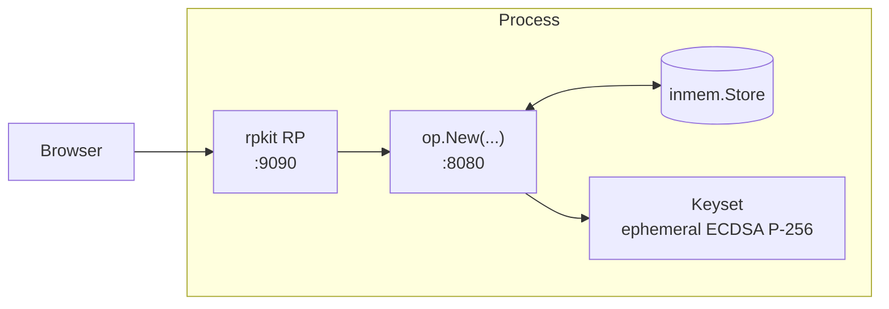

# Use case — Minimal OP

You want a working Authorization Code + PKCE round-trip end-to-end with the absolute minimum option list. The upstream example brings the OP and a paired RP up in the same process so a browser can drive the full flow without any external setup.

> **Source:** [`examples/01-minimal/main.go`](https://github.com/libraz/go-oidc-provider/tree/main/examples/01-minimal)

## Architecture



The library is one process. The store is in-memory. Keys are generated at boot. The example seeds one demo user (`demo`/`demo`) and registers a public client whose `redirect_uri` points back at the embedded RP.

## Code (essentials)

```go
package main

import (
  "log"
  "net/http"

  "github.com/libraz/go-oidc-provider/op"
  "github.com/libraz/go-oidc-provider/op/storeadapter/inmem"
)

func main() {
  keys := /* devkeys.MustEphemeral("minimal-1") in the example */
  st := inmem.New()
  // seedUser hashes "demo"/"demo" via op.HashPassword and PUTs a
  // *store.User into st.UserPasswords(); see the example for the body.

  // The upstream example uses opkit.DefaultLoginFlow(st.UserPasswords())
  // from examples/internal/opkit — a thin wrapper that constructs the
  // same value below. The public API is the LoginFlow struct shown here;
  // import opkit only if you are reading the example's source, not for
  // production code.
  flow := op.LoginFlow{
    Primary: op.PrimaryPassword{Store: st.UserPasswords()},
  }

  provider, err := op.New(
    op.WithIssuer("http://127.0.0.1:8080"),
    op.WithStore(st),
    op.WithKeyset(keys.Keyset()),
    op.WithCookieKeys(keys.CookieKey),
    op.WithLoginFlow(flow),
    op.WithStaticClients(op.PublicClient{
      ID:           "demo-rp",
      RedirectURIs: []string{"http://127.0.0.1:9090/callback"},
      Scopes:       []string{"openid", "profile"},
    }),
  )
  if err != nil {
    log.Fatalf("op.New: %v", err)
  }

  mux := http.NewServeMux()
  mux.Handle("/", provider)
  log.Fatal(http.ListenAndServe(":8080", mux))
}
```

The four required options (`WithIssuer`, `WithStore`, `WithKeyset`, `WithCookieKeys`) on their own would let `/oidc/.well-known/openid-configuration` and `/oidc/jwks` answer; everything that depends on a user (authorize, token, userinfo) needs the `WithLoginFlow` + `WithStaticClients` pair. [`getting-started/minimal`](/getting-started/minimal) shows the four-option discovery-only shape if that is what you want.

## What the OP exposes

The defaults mount under `/oidc` (override with `op.WithMountPrefix`):

| Path | Purpose |
|---|---|
| `/.well-known/openid-configuration` | Discovery (always at root, OIDC Discovery 1.0 §4) |
| `/oidc/jwks` | Public JWKS for ID Token / JWT access token verification |
| `/oidc/auth` | Authorization endpoint |
| `/oidc/token` | Token endpoint |
| `/oidc/userinfo` | UserInfo (RFC 6749 + OIDC Core §5.3) |
| `/oidc/end_session` | RP-Initiated Logout 1.0 |

Optional endpoints (`/par`, `/introspect`, `/revoke`, `/register`, `/interaction/*`, `/session/*`) only mount when their corresponding feature is enabled.

## What's missing for a real deployment

| Gap | Fix |
|---|---|
| Single demo user is hard-coded | Enrol users through your own management plane and `store.User` PUTs. |
| Ephemeral keys → ID Tokens become unverifiable on restart | Load from a vault / KMS / file. |
| In-memory store → state lost on restart | Switch to `op/storeadapter/sql` or `op/storeadapter/composite`. |
| Plain HTTP listener (`http://127.0.0.1`) | Front behind a TLS-terminating ingress; switch issuer to `https://`. |
| Single-factor (password only) | Add `RuleAlways(StepTOTP{...})` — see [MFA / step-up](/use-cases/mfa-step-up). |
| Demo RP code in `examples/internal/rpkit` | Production RPs use `golang.org/x/oauth2` + `github.com/coreos/go-oidc/v3` directly. |

[`examples/02-bundle`](https://github.com/libraz/go-oidc-provider/tree/main/examples/02-bundle) fills these in for a "comprehensive embedder" reference.

## Run it

```sh
git clone https://github.com/libraz/go-oidc-provider.git
cd go-oidc-provider
go run -tags example ./examples/01-minimal
# in another terminal:
curl -s http://localhost:8080/.well-known/openid-configuration | jq
```
