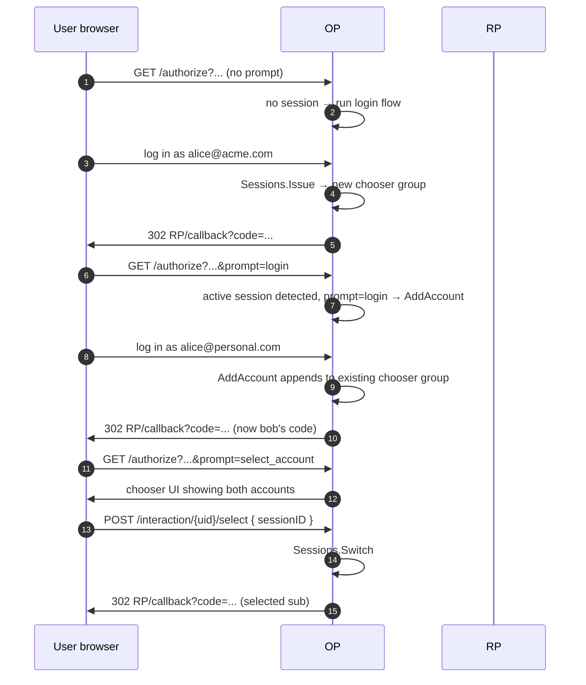

# Use case — Multi-account chooser

::: warning v0.9.x — chooser template option not wired yet
The session manager APIs and the bundled chooser interaction described below ship today. The `op.WithChooserUI` option that lets you swap in a custom template, however, is reserved for the v1.0 surface and currently causes `op.New` to return a configuration error. Until the runtime mount lands, leave the option unset and rely on the bundled chooser template.
:::

## What is `prompt=select_account`?

OIDC Core 1.0 §3.1.2.1 defines a `prompt` request parameter the RP sends with `/authorize`. Three values matter for this page:

| `prompt=` | What it asks the OP to do |
|---|---|
| `none` | Don't show any UI — just return the active session, or fail. |
| `login` | Force a fresh login even if a session is active. |
| `select_account` | Show an account chooser — the user picks which account to continue with. |

`select_account` is what the "switch account" button on big SaaS products fires. The user has multiple accounts signed in to the same OP browser session (work + personal, or alice + bob); the OP renders a list and lets them choose.

This library implements it as a **chooser group** in the session manager: a group of sessions the same browser is signed into, with APIs to add, switch between, and log out the whole set.

::: details Specs referenced on this page
- [OpenID Connect Core 1.0](https://openid.net/specs/openid-connect-core-1_0.html) — §3.1.2.1 (`prompt` parameter), §3.1.2.4 (interaction with consent)
- [OpenID Connect Back-Channel Logout 1.0](https://openid.net/specs/openid-connect-backchannel-1_0.html) — fan-out when "log everyone out" fires
:::

::: details Vocabulary refresher
- **`prompt` parameter** — A request hint the RP sends with `/authorize` to tell the OP whether to show UI: `none` (silent — return active session or fail), `login` (force fresh login), `consent` (force consent prompt), `select_account` (show account chooser). Multiple values may be space-separated.
- **Chooser group** — A group of sessions the same browser is signed into. Big SaaS products surface this as the "switch account" menu. The OP keeps the group server-side; cookies tie the browser to the group, not to a single session.
- **`sub` (subject)** — The stable opaque identifier for the user, scoped to the OP-RP pair. Switching accounts in the chooser changes which `sub` ends up in the next `id_token` — same browser, different identity.
:::

> **Source:** [`examples/13-multi-account`](https://github.com/libraz/go-oidc-provider/tree/main/examples/13-multi-account)

## How it works

## Wiring

The library ships a built-in interaction for `prompt=select_account` that emits an `interaction.ChooserPromptData` envelope listing every account in the active chooser group. With the default HTML driver, the bundled template renders the list and the user POSTs back the `SessionID`. With the JSON driver (`op.WithInteractionDriver(interaction.JSONDriver{})`), the SPA receives the same envelope as JSON and posts back the `SessionID`.

The session manager exposes the orchestration:

| Method | When |
|---|---|
| `Sessions.Issue(ctx, subject)` | First login → new chooser group |
| `Sessions.AddAccount(ctx, group, subject)` | Second login in the same browser → joins existing group |
| `Sessions.Switch(ctx, group, sessionID)` | User picked an account in the chooser |
| `Sessions.LogoutAll(ctx, group)` | Sign out everyone |

## Read next

- [SPA / custom interaction](/use-cases/spa-custom-interaction) — drive the chooser from a SPA.
- [Back-Channel Logout](/use-cases/back-channel-logout) — fan-out when the user logs everyone out.
