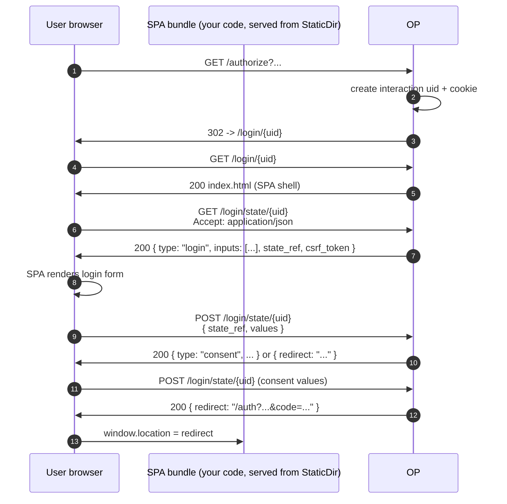

# Use case — SPA / custom interaction

## What is the "interaction" layer?

Between the RP's `/authorize` redirect and the OP's redirect-back-with- code, the OP runs an **interaction** — login, optional MFA step-up, optional consent prompt, optional account chooser. OIDC Core 1.0 §3.1 specifies what data crosses the wire (the request parameters and the final response) but is silent on **how the OP renders these intermediate pages**. Each OP picks its own UX.

This library models the UX as a pluggable `interaction.Driver`. The default driver renders server-side HTML; the JSON driver returns the same prompts as JSON (so a SPA can render them); custom drivers can talk to whatever front-end you ship.

::: details Specs referenced on this page
- [OpenID Connect Core 1.0](https://openid.net/specs/openid-connect-core-1_0.html) — §3.1 (authorization endpoint), §3.1.2.4 (consent)
- [OpenID Connect RP-Initiated Logout 1.0](https://openid.net/specs/openid-connect-rpinitiated-1_0.html) — `/end_session`
- [RFC 7636](https://datatracker.ietf.org/doc/html/rfc7636) — PKCE (Proof Key for Code Exchange)
- [RFC 8252](https://datatracker.ietf.org/doc/html/rfc8252) — OAuth 2.0 for Native Apps, §8.1 (browser-side public clients)
- [RFC 6749](https://datatracker.ietf.org/doc/html/rfc6749) — §5.2 (error response JSON envelope)
:::

::: details Vocabulary refresher
- **Interaction layer** — Everything between the RP's `/authorize` redirect and the OP's redirect-back-with-code: login, optional MFA step-up, optional consent, optional account chooser. The wire-protocol parameters are spec-defined; *how* the OP renders these intermediate pages is not. Each OP picks its own UX, and that's the seam this page exposes.
- **JSON driver** — The library's pluggable interaction backend that returns prompts as JSON instead of HTML. The state machine still lives in the OP — the SPA fetches `{ kind: "login" | "consent" | ... }` and posts answers back. The OP decides what to render next.
- **CSP (Content Security Policy)** — A response header (`Content-Security-Policy: default-src 'none'; ...`) that tells the browser which resources a page is allowed to load. The OP's error page renders under a strict policy that blocks `<script>`, inline event handlers, and arbitrary URL schemes — so a hostile `error_description` cannot escalate into XSS.
:::

> **Sources:** - [`examples/04-custom-interaction`](https://github.com/libraz/go-oidc-provider/tree/main/examples/04-custom-interaction) — minimal swap to JSON driver. - [`examples/10-react-login`](https://github.com/libraz/go-oidc-provider/tree/main/examples/10-react-login) — full SPA wiring via `op.WithSPAUI`. The bundle in the example is hand-rolled vanilla HTML/CSS/JS so it runs without a build step, but the seam is framework-neutral; React / Vue / Svelte / Angular drop in identically under `StaticDir`.

## Architecture

`WithSPAUI` mounts a fixed route tree under `LoginMount` (the example uses `/login`):

| Method | Path | Role |
|---|---|---|
| `GET` | `LoginMount/{uid}` | SPA shell — serves `StaticDir/index.html` |
| `GET` | `LoginMount/state/{uid}` | Current prompt as JSON |
| `POST` | `LoginMount/state/{uid}` | User submission for the current prompt |
| `DELETE` | `LoginMount/state/{uid}` | Cancel the in-flight interaction |
| `GET` | `LoginMount/assets/{path...}` | Static asset fan-out from `StaticDir` |

`/authorize` redirects to `LoginMount/{uid}` (replacing the legacy `/oidc/interaction/{uid}` path). Everything between the redirect and the redirect-back-with-code stays on the SPA.



The state machine lives on the OP. The SPA fetches the next prompt, posts back the user's answer, and the OP decides what to render next.

## Code

### Swap to the JSON driver (smallest possible change)

```go
import "github.com/libraz/go-oidc-provider/op/interaction"

provider, err := op.New(
  /* required options */
  op.WithInteraction(interaction.JSONDriver{}),
)
```

Now every interaction page returns JSON. Your SPA polls the prompts and posts answers back.

### SPA wiring (framework-neutral)

```go
import "github.com/libraz/go-oidc-provider/op"

provider, err := op.New(
  /* required options */
  op.WithSPAUI(op.SPAUI{
    LoginMount: "/login",       // SPA login entry path (required)
    StaticDir:  "./web/dist",   // SPA bundle on disk
  }),
  op.WithCORSOrigins("https://app.example.com"),
)

mux := http.NewServeMux()
mux.Handle("/", provider)       // OP owns /login/{uid}, /login/state/{uid},
                                // /login/assets/{path...}, and the rest of
                                // the protocol surface — no outer routing
                                // needed.
```

That single `mux.Handle("/", provider)` is enough. The OP serves the SPA shell at `/login/{uid}`, the prompt JSON at `/login/state/{uid}`, and any file under `StaticDir` at `/login/assets/{path...}`. Pick the framework that fits your stack — the Go side is the same either way.

::: info Mount field status (v0.x)
`SPAUI` carries `LoginMount`, `ConsentMount`, `LogoutMount`, and `StaticDir`. Today, **only `LoginMount` and `StaticDir` are auto-mounted**; consent and RP-Initiated Logout flow through the same `LoginMount/state/{uid}` JSON surface (the SPA branches on `prompt.type`). `ConsentMount` and `LogoutMount` are accepted at construction time but reserved for a future release where they get their own routes — populating them today is a no-op.
:::

### Frontend snippet

::: code-group

```jsx [React]
import { useEffect, useState } from "react";

// FieldKind iota in op/interaction:
//   0=text, 1=password, 2=otp, 3=email, 4=hidden.
const inputTypeFor = (kind) =>
  ({ 1: "password", 3: "email", 4: "hidden" })[kind] ?? "text";

export function Interaction({ uid }) {
  const stateURL = `/login/state/${uid}`;
  const [prompt, setPrompt] = useState(null);
  const [values, setValues] = useState({});

  useEffect(() => {
    fetch(stateURL, {
      headers: { Accept: "application/json" },
      credentials: "same-origin",
    })
      .then((r) => r.json())
      .then(setPrompt);
  }, [uid]);

  async function onSubmit(e) {
    e.preventDefault();
    const r = await fetch(stateURL, {
      method: "POST",
      headers: {
        "Content-Type": "application/json",
        "X-CSRF-Token": prompt.csrf_token ?? "",
        Accept: "application/json",
      },
      credentials: "same-origin",
      body: JSON.stringify({ state_ref: prompt.state_ref, values }),
    });
    const next = await r.json();
    if (next.type === "redirect" && next.location) {
      window.location.href = next.location;
    } else {
      setPrompt(next);
      setValues({});
    }
  }

  if (!prompt) return null;
  return (
    <form onSubmit={onSubmit}>
      {prompt.inputs?.map((f) => (
        <label key={f.Name}>
          <span>{f.Label || f.Name}</span>
          <input
            name={f.Name}
            type={inputTypeFor(f.Kind)}
            required={f.Required}
            onChange={(e) =>
              setValues((v) => ({ ...v, [f.Name]: e.target.value }))
            }
          />
        </label>
      ))}
      <button type="submit">Continue</button>
    </form>
  );
}
```

```vue [Vue 3]
<script setup>
import { ref, reactive, onMounted } from "vue";

const props = defineProps({ uid: String });
const stateURL = `/login/state/${props.uid}`;
const prompt = ref(null);
const values = reactive({});

// FieldKind iota in op/interaction:
//   0=text, 1=password, 2=otp, 3=email, 4=hidden.
const inputTypeFor = (kind) =>
  ({ 1: "password", 3: "email", 4: "hidden" })[kind] ?? "text";

onMounted(async () => {
  const r = await fetch(stateURL, {
    headers: { Accept: "application/json" },
    credentials: "same-origin",
  });
  prompt.value = await r.json();
});

async function onSubmit() {
  const r = await fetch(stateURL, {
    method: "POST",
    headers: {
      "Content-Type": "application/json",
      "X-CSRF-Token": prompt.value.csrf_token ?? "",
      Accept: "application/json",
    },
    credentials: "same-origin",
    body: JSON.stringify({
      state_ref: prompt.value.state_ref,
      values,
    }),
  });
  const next = await r.json();
  if (next.type === "redirect" && next.location) {
    window.location.href = next.location;
  } else {
    prompt.value = next;
    for (const k of Object.keys(values)) delete values[k];
  }
}
</script>

<template>
  <form v-if="prompt" @submit.prevent="onSubmit">
    <label v-for="f in prompt.inputs" :key="f.Name">
      <span>{{ f.Label || f.Name }}</span>
      <input
        :name="f.Name"
        :type="inputTypeFor(f.Kind)"
        :required="f.Required"
        v-model="values[f.Name]"
      />
    </label>
    <button type="submit">Continue</button>
  </form>
</template>
```

:::

Both tabs follow the same flow: GET the prompt at `/login/state/{uid}`, render the declared `inputs`, POST `{state_ref, values}` back. The OP either returns the next prompt or a terminal `{type: "redirect", location: "..."}` envelope the SPA follows with `window.location.href`. The wire shape comes straight from `op/interaction`:

- `Prompt` — `type`, `data`, `inputs`, `state_ref`, `csrf_token` (lower_snake_case JSON tags).
- `FieldSpec` — capitalised field names (`Name`, `Kind`, `Label`, `Required`, `MaxLen`, `MinLen`, `Pattern`) because it has no JSON tags. `Kind` is the integer enum above.
- Terminal redirect envelope — `{"type":"redirect","location":"<URL>"}`. The OP rewrites the orchestrator's terminal 302 into this shape so the SPA can navigate at the document level (a cross-origin `fetch` cannot follow the RP-callback redirect on its own).

The contract is identical across frameworks — only the rendering idiom differs.

::: tip Consent step
When `prompt.type === "consent.scope"` the OP omits `inputs` and moves the scope catalogue into `prompt.data.scopes`. The SPA renders that list (with `s.required` styled as non-toggleable) and submits `{ approved_scopes: "openid profile" }` (a space-joined subset). See [`examples/10-react-login`](https://github.com/libraz/go-oidc-provider/tree/main/examples/10-react-login)'s `web/static/assets/main.js` for a worked switch on `prompt.type`.
:::

::: info Why send `X-CSRF-Token`?
The OP issues a `__Host-oidc_csrf` cookie at session start and echoes the same value into every prompt envelope as `csrf_token`. The SPA's only job is to copy `prompt.csrf_token` into the `X-CSRF-Token` header on submission — the OP compares the header against the cookie (double-submit cookie pattern). The SPA never generates, validates, or stores the token, and the cookie stays `HttpOnly`.
:::

## SPA-safe error rendering

The OP's error pages emit a stable anchor with `data-*` attributes so the SPA host can read them with one `document.querySelector`:

```html
<div id="op-error"
     data-code="invalid_request_uri"
     data-description="request_uri has expired"
     data-state="abc">
  <h1>Authorization error</h1>
  ...
</div>
```

::: info CSP-safe by construction
The error page renders under `default-src 'none'; style-src 'unsafe-inline'`: no `<script>`, no inline event handlers, no inline images, no `javascript:` URLs. Hostile values in `error_description` / `state` are HTML-escaped before reflection.
:::

The OP also negotiates by `Accept` header:
- `Accept: text/html` (browser navigation) → HTML page with `data-*`.
- `Accept: application/json` (XHR / fetch) → RFC 6749 §5.2 JSON envelope.
- Absent or `*/*` → JSON envelope (the safe default for XHR / curl).

This means your SPA's `fetch()` calls keep getting JSON, and a user who mis-types the URL into the address bar gets a renderable error page with machine-readable attributes the SPA can pick up if it loads.

## CORS

If the SPA is served from a different origin than the OP, you'll need to allow it explicitly:

```go
op.WithCORSOrigins(
  "https://app.example.com",
  "https://staging-app.example.com",
)
```

Per-RP, the library also auto-allowlists each registered `redirect_uri`'s origin (so a static client setup doesn't need duplicate CORS config). See [Use case: CORS for SPA](/use-cases/cors-spa).

## Custom consent UI without going full-SPA

If you only need a custom consent page (e.g. branded copy + privacy links), `op.WithConsentUI(...)` swaps just that template. See [`examples/11-custom-consent-ui`](https://github.com/libraz/go-oidc-provider/tree/main/examples/11-custom-consent-ui).
