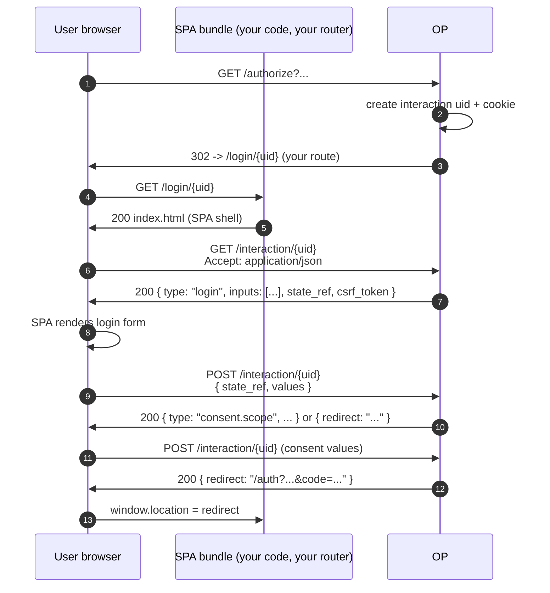

# Use case — SPA / custom interaction

::: warning v0.9.x — `op.WithSPAUI` is not wired yet
The option type stays public so future plans can refer to it, but `op.New` returns a configuration error if you pass it today. The handler that would auto-mount the SPA shell, the static asset tree, and the JSON state surface under one option is reserved for the v1.0 surface. Until it lands, drive your SPA via `op.WithInteractionDriver(interaction.JSONDriver{})` and serve the SPA shell + assets from your own router. The pattern in the rest of this page reflects that.
:::

## What is the "interaction" layer?

Between the RP's `/authorize` redirect and the OP's redirect-back-with- code, the OP runs an **interaction** — login, optional MFA step-up, optional consent prompt, optional account chooser. OIDC Core 1.0 §3.1 specifies what data crosses the wire (the request parameters and the final response) but is silent on **how the OP renders these intermediate pages**. Each OP picks its own UX.

This library models the UX as a pluggable `interaction.Driver`. The default driver renders server-side HTML; the JSON driver returns the same prompts as JSON (so a SPA can render them); custom drivers can talk to whatever front-end you ship.

::: details Specs referenced on this page
- [OpenID Connect Core 1.0](https://openid.net/specs/openid-connect-core-1_0.html) — §3.1 (authorization endpoint), §3.1.2.4 (consent)
- [OpenID Connect RP-Initiated Logout 1.0](https://openid.net/specs/openid-connect-rpinitiated-1_0.html) — `/end_session`
- [RFC 7636](https://datatracker.ietf.org/doc/html/rfc7636) — PKCE (Proof Key for Code Exchange)
- [RFC 8252](https://datatracker.ietf.org/doc/html/rfc8252) — OAuth 2.0 for Native Apps, §8.1 (browser-side public clients)
- [RFC 6749](https://datatracker.ietf.org/doc/html/rfc6749) — §5.2 (error response JSON envelope)
:::

::: details Vocabulary refresher
- **Interaction layer** — Everything between the RP's `/authorize` redirect and the OP's redirect-back-with-code: login, optional MFA step-up, optional consent, optional account chooser. The wire-protocol parameters are spec-defined; *how* the OP renders these intermediate pages is not. Each OP picks its own UX, and that's the seam this page exposes.
- **JSON driver** — The library's pluggable interaction backend that returns prompts as JSON instead of HTML. The state machine still lives in the OP — the SPA fetches `{ kind: "login" | "consent" | ... }` and posts answers back. The OP decides what to render next.
- **CSP (Content Security Policy)** — A response header (`Content-Security-Policy: default-src 'none'; ...`) that tells the browser which resources a page is allowed to load. The OP's error page renders under a strict policy that blocks `<script>`, inline event handlers, and arbitrary URL schemes — so a hostile `error_description` cannot escalate into XSS.
:::

> **Sources:** - [`examples/04-custom-interaction`](https://github.com/libraz/go-oidc-provider/tree/main/examples/04-custom-interaction) — minimal swap to the JSON driver. - [`examples/10-react-login`](https://github.com/libraz/go-oidc-provider/tree/main/examples/10-react-login) — full SPA wiring on top of the JSON driver. The bundle in the example is hand-rolled vanilla HTML/CSS/JS so it runs without a build step, but the seam is framework-neutral; React / Vue / Svelte / Angular drop in identically.

## Architecture

The OP exposes the interaction state machine at `/interaction/{uid}` regardless of driver. With the JSON driver, every prompt comes back as JSON; your own router serves the SPA shell + static assets at whatever path you pick.

| Method | Path | Role |
|---|---|---|
| `GET` | `/interaction/{uid}` (JSON driver) | Current prompt as JSON |
| `POST` | `/interaction/{uid}` (JSON driver) | User submission for the current prompt |
| `DELETE` | `/interaction/{uid}` (JSON driver) | Cancel the in-flight interaction |
| `GET` | _your route_ | SPA shell (serves your bundle's `index.html`) |
| `GET` | _your route_ | Static asset fan-out (your bundle) |

`/authorize` redirects to `/interaction/{uid}`. Everything between the redirect and the redirect-back-with-code stays on the SPA.



The state machine lives on the OP. The SPA fetches the next prompt, posts back the user's answer, and the OP decides what to render next.

## Code

### Swap to the JSON driver (smallest possible change)

```go
import "github.com/libraz/go-oidc-provider/op/interaction"

provider, err := op.New(
  /* required options */
  op.WithInteractionDriver(interaction.JSONDriver{}),
)
```

Now every interaction page returns JSON. Your SPA polls the prompts and posts answers back.

### SPA wiring (framework-neutral)

```go
import (
  "net/http"

  "github.com/libraz/go-oidc-provider/op"
  "github.com/libraz/go-oidc-provider/op/interaction"
)

provider, err := op.New(
  /* required options */
  op.WithInteractionDriver(interaction.JSONDriver{}),
  op.WithCORSOrigins("https://app.example.com"),
)

mux := http.NewServeMux()
// SPA shell + static assets on your own routes.
mux.Handle("GET /login/", http.StripPrefix("/login/", http.FileServer(http.Dir("./web/dist"))))
// OP owns /interaction/{uid} and the rest of the protocol surface.
mux.Handle("/", provider)
```

The OP returns the prompt JSON at `/interaction/{uid}`; your SPA bundle at `/login/...` consumes it via `fetch`. Pick the framework that fits your stack — the Go side is the same either way.

::: info Routing redirect targets to the SPA
`/authorize` redirects to `/interaction/{uid}` by default. To send the user to your SPA shell first (so the bundle loads, then the shell calls `/interaction/{uid}` with `Accept: application/json`), serve the SPA shell at the path your SPA expects (e.g. `/login/{uid}`) and let it fetch from `/interaction/{uid}` directly. The state surface and the visual shell are decoupled by design — the OP owns the state, your router owns the visual.
:::

::: info `op.WithSPAUI` (reserved)
`op.SPAUI` will, in v1.0, carry `LoginMount`, `ConsentMount`, `LogoutMount`, and `StaticDir` so the OP can auto-mount the SPA shell, the static asset tree, and the prompt JSON under one option. Today the type stays public for forward compatibility but `op.New` rejects it; pass `interaction.JSONDriver` and your own router instead.
:::

### Frontend snippet

::: code-group

```jsx [React]
import { useEffect, useState } from "react";

// FieldKind iota in op/interaction:
//   0=text, 1=password, 2=otp, 3=email, 4=hidden.
const inputTypeFor = (kind) =>
  ({ 1: "password", 3: "email", 4: "hidden" })[kind] ?? "text";

export function Interaction({ uid }) {
  const stateURL = `/interaction/${uid}`;
  const [prompt, setPrompt] = useState(null);
  const [values, setValues] = useState({});

  useEffect(() => {
    fetch(stateURL, {
      headers: { Accept: "application/json" },
      credentials: "same-origin",
    })
      .then((r) => r.json())
      .then(setPrompt);
  }, [uid]);

  async function onSubmit(e) {
    e.preventDefault();
    const r = await fetch(stateURL, {
      method: "POST",
      headers: {
        "Content-Type": "application/json",
        "X-CSRF-Token": prompt.csrf_token ?? "",
        Accept: "application/json",
      },
      credentials: "same-origin",
      body: JSON.stringify({ state_ref: prompt.state_ref, values }),
    });
    const next = await r.json();
    if (next.type === "redirect" && next.location) {
      window.location.href = next.location;
    } else {
      setPrompt(next);
      setValues({});
    }
  }

  if (!prompt) return null;
  return (
    <form onSubmit={onSubmit}>
      {prompt.inputs?.map((f) => (
        <label key={f.Name}>
          <span>{f.Label || f.Name}</span>
          <input
            name={f.Name}
            type={inputTypeFor(f.Kind)}
            required={f.Required}
            onChange={(e) =>
              setValues((v) => ({ ...v, [f.Name]: e.target.value }))
            }
          />
        </label>
      ))}
      <button type="submit">Continue</button>
    </form>
  );
}
```

```vue [Vue 3]
<script setup>
import { ref, reactive, onMounted } from "vue";

const props = defineProps({ uid: String });
const stateURL = `/interaction/${props.uid}`;
const prompt = ref(null);
const values = reactive({});

// FieldKind iota in op/interaction:
//   0=text, 1=password, 2=otp, 3=email, 4=hidden.
const inputTypeFor = (kind) =>
  ({ 1: "password", 3: "email", 4: "hidden" })[kind] ?? "text";

onMounted(async () => {
  const r = await fetch(stateURL, {
    headers: { Accept: "application/json" },
    credentials: "same-origin",
  });
  prompt.value = await r.json();
});

async function onSubmit() {
  const r = await fetch(stateURL, {
    method: "POST",
    headers: {
      "Content-Type": "application/json",
      "X-CSRF-Token": prompt.value.csrf_token ?? "",
      Accept: "application/json",
    },
    credentials: "same-origin",
    body: JSON.stringify({
      state_ref: prompt.value.state_ref,
      values,
    }),
  });
  const next = await r.json();
  if (next.type === "redirect" && next.location) {
    window.location.href = next.location;
  } else {
    prompt.value = next;
    for (const k of Object.keys(values)) delete values[k];
  }
}
</script>

<template>
  <form v-if="prompt" @submit.prevent="onSubmit">
    <label v-for="f in prompt.inputs" :key="f.Name">
      <span>{{ f.Label || f.Name }}</span>
      <input
        :name="f.Name"
        :type="inputTypeFor(f.Kind)"
        :required="f.Required"
        v-model="values[f.Name]"
      />
    </label>
    <button type="submit">Continue</button>
  </form>
</template>
```

:::

Both tabs follow the same flow: GET the prompt at `/interaction/{uid}`, render the declared `inputs`, POST `{state_ref, values}` back. The OP either returns the next prompt or a terminal `{type: "redirect", location: "..."}` envelope the SPA follows with `window.location.href`. The wire shape comes straight from `op/interaction`:

- `Prompt` — `type`, `data`, `inputs`, `state_ref`, `csrf_token`, plus the locale envelope (`locale`, `ui_locales_hint`, `locales_available` — see [i18n / locale negotiation](/use-cases/i18n#reading-the-resolved-locale)). All lower_snake_case JSON tags.
- `FieldSpec` — capitalised field names (`Name`, `Kind`, `Label`, `Required`, `MaxLen`, `MinLen`, `Pattern`) because it has no JSON tags. `Kind` is the integer enum above.
- Terminal redirect envelope — `{"type":"redirect","location":"<URL>"}`. The OP rewrites the orchestrator's terminal 302 into this shape so the SPA can navigate at the document level (a cross-origin `fetch` cannot follow the RP-callback redirect on its own).

The contract is identical across frameworks — only the rendering idiom differs.

::: tip Consent step
When `prompt.type === "consent.scope"` the OP omits `inputs` and moves the scope catalogue into `prompt.data.scopes`. The SPA renders that list (with `s.required` styled as non-toggleable) and submits `{ approved_scopes: "openid profile" }` (a space-joined subset). See [`examples/10-react-login`](https://github.com/libraz/go-oidc-provider/tree/main/examples/10-react-login)'s `web/static/assets/main.js` for a worked switch on `prompt.type`.
:::

::: info Why send `X-CSRF-Token`?
The OP issues a `__Host-oidc_csrf` cookie at session start and echoes the same value into every prompt envelope as `csrf_token`. The SPA's only job is to copy `prompt.csrf_token` into the `X-CSRF-Token` header on submission — the OP compares the header against the cookie (double-submit cookie pattern). The SPA never generates, validates, or stores the token, and the cookie stays `HttpOnly`.
:::

## SPA-safe error rendering

The OP's error pages emit a stable anchor with `data-*` attributes so the SPA host can read them with one `document.querySelector`:

```html
<div id="op-error"
     data-code="invalid_request_uri"
     data-description="request_uri has expired"
     data-state="abc">
  <h1>Authorization error</h1>
  ...
</div>
```

::: info CSP-safe by construction
The error page renders under `default-src 'none'; style-src 'unsafe-inline'`: no `<script>`, no inline event handlers, no inline images, no `javascript:` URLs. Hostile values in `error_description` / `state` are HTML-escaped before reflection.
:::

The OP also negotiates by `Accept` header:
- `Accept: text/html` (browser navigation) → HTML page with `data-*`.
- `Accept: application/json` (XHR / fetch) → RFC 6749 §5.2 JSON envelope.
- Absent or `*/*` → JSON envelope (the safe default for XHR / curl).

This means your SPA's `fetch()` calls keep getting JSON, and a user who mis-types the URL into the address bar gets a renderable error page with machine-readable attributes the SPA can pick up if it loads.

## CORS

If the SPA is served from a different origin than the OP, you'll need to allow it explicitly:

```go
op.WithCORSOrigins(
  "https://app.example.com",
  "https://staging-app.example.com",
)
```

Per-RP, the library also auto-allowlists each registered `redirect_uri`'s origin (so a static client setup doesn't need duplicate CORS config). See [Use case: CORS for SPA](/use-cases/cors-spa).

## Custom consent UI without going full-SPA

If you only need to rebrand the consent strings (translated copy, brand voice), `op.WithLocale` overlays your keys on top of the seed bundles at key granularity — the bundled HTML driver picks the overlay up automatically and you keep the bundled CSP / CSRF scheme. See [Custom consent UI](/use-cases/custom-consent-ui) and [i18n / locale negotiation](/use-cases/i18n).

`op.WithConsentUI` (custom consent template) is reserved for v1.0 and currently rejected at `op.New`; until it lands, the JSON driver above is the path that lets you own the markup.
