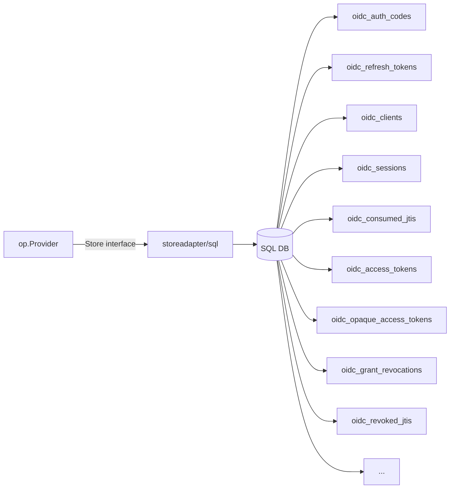

# Use case — Persistent storage (SQL)

## What does the OP store, and why does it matter where?

The OP holds rows the OAuth/OIDC specs require to be **persistent
across restarts**:

- **Refresh-token chains** (RFC 6749 §6, RFC 9700 §4.14) — losing them
  signs every user out.
- **Registered clients** (OIDC Dynamic Client Registration 1.0 / RFC
  7591 when enabled, or static seeds otherwise) — losing them breaks
  every RP.
- **Sessions** (OIDC RP-Initiated Logout 1.0, Back-Channel Logout 1.0)
  — needed to fan out logout to other RPs.
- **Consent grants** (OIDC Core 1.0 §3.1.2.4) — losing them re-prompts
  every user on every restart.
- **Audit / introspection / revocation shadow rows** — the access-token
  registry described in [Tokens](/concepts/tokens).

The default `inmem` store loses everything on restart, which is fine
for tests and demos but unsafe for production. The library ships
[`op/storeadapter/sql`](https://github.com/libraz/go-oidc-provider/tree/main/op/storeadapter/sql),
a `database/sql` adapter that targets **SQLite, MySQL 8.0+, and
PostgreSQL 14+**.

> **Sources:**
> - [`examples/06-sql-store`](https://github.com/libraz/go-oidc-provider/tree/main/examples/06-sql-store) — SQLite quick start (CGO-free).
> - [`examples/07-mysql-store`](https://github.com/libraz/go-oidc-provider/tree/main/examples/07-mysql-store) — MySQL with production-shaped pool, paired with an in-process RP and shipped as a docker-compose stack.

## Why a sub-module

The SQL adapter is published as a **separate Go module**, so its driver
dependencies (the SQL driver, migration libraries) don't pollute your
`go.sum` until you opt in:

```sh
go get github.com/libraz/go-oidc-provider/op/storeadapter/sql@latest
```

The same applies to the Redis adapter.

## Architecture



Every substore (`AuthCodeStore`, `RefreshTokenStore`, `ClientStore`,
`SessionStore`, etc.) maps to a table.

::: info New substores
The SQL adapter bundles tables for the opaque-access-token substore
(`oidc_opaque_access_tokens`, populated only when
`op.WithAccessTokenFormat(op.AccessTokenFormatOpaque)` or
`op.WithAccessTokenFormatPerAudience(...)` is configured) and for the
grant-revocation substore (`oidc_grant_revocations` plus
`oidc_revoked_jtis`, the backing store for the default
`RevocationStrategyGrantTombstone`). Both are part of the
transactional cluster — they commit alongside the grant or refresh
write that triggered them, so a half-committed cascade cannot leave a
revoked grant next to a still-redeemable token.

Embedders shipping a custom `Store` aggregator (rather than reusing
the bundled adapters) MUST implement `OpaqueAccessTokens()` and
`GrantRevocations()`. Returning `nil` is permitted when the matching
option is never used; `op.New` fails fast otherwise.
:::

## Code

```go
import (
  _ "github.com/mattn/go-sqlite3" // or your MySQL / Postgres driver

  "github.com/libraz/go-oidc-provider/op"
  "github.com/libraz/go-oidc-provider/op/storeadapter/sql"
)

db, err := stdsql.Open("sqlite3", "file:op.db?_journal=WAL&_busy_timeout=5000")
if err != nil { /* ... */ }

store, err := sql.Open(db, sql.Dialect{
  Driver: sql.DriverSQLite, // or DriverMySQL, DriverPostgres
})
if err != nil { /* ... */ }

provider, err := op.New(
  op.WithIssuer("https://op.example.com"),
  op.WithStore(store),
  op.WithKeyset(myKeyset),
  op.WithCookieKey(myCookieKey),
)
```

::: tip Migrations
The adapter ships its own schema migrations (versioned). Run them at
deploy time before the first request lands. The exact API is in the
sub-module's godoc.
:::

## MySQL pool sizing

[`examples/07-mysql-store`](https://github.com/libraz/go-oidc-provider/tree/main/examples/07-mysql-store)
demonstrates a production-shaped DSN:

```go
db, err := stdsql.Open("mysql",
  "oidc:secret@tcp(mysql:3306)/op?parseTime=true&charset=utf8mb4&collation=utf8mb4_0900_ai_ci")
db.SetMaxOpenConns(64)
db.SetMaxIdleConns(8)
db.SetConnMaxLifetime(30 * time.Minute)
```

`charset=utf8mb4` is required so 4-byte UTF-8 (emoji, CJK extensions in
display names) round-trips through claim values without truncation.

## Username + password credentials

The SQL adapter implements `store.UserPasswordStore` (the same surface
the inmem reference adapter exposes) so the built-in
[`op.PrimaryPassword`](/use-cases/mfa-step-up) Step works against
SQL with no glue code:

```go
flow := op.LoginFlow{
  Primary: op.PrimaryPassword{Store: storage.UserPasswords()},
}

provider, err := op.New(
  /* ... */
  op.WithLoginFlow(flow),
)
```

The schema adds two columns on `oidc_users`: a unique `username` lookup
index (used by `FindByUsername`) and a PHC-encoded `password_hash`
column (read by `ReadPasswordHash`). Hash encoding stays in the
embedder's hands — the convenience writer
`*sql.Store.PutUserWithPassword(ctx, user, username, hash)` accepts a
hash produced by `op.HashPassword` (argon2id with the library
defaults) and round-trips through the same upsert as `PutUser`:

```go
hash, _ := op.HashPassword("demo")
_ = storage.PutUserWithPassword(ctx, &store.User{
  Subject: "demo-user",
  Claims:  map[string]any{"name": "Demo User"},
}, "demo", hash)
```

Passing an empty username and `nil` hash clears the credential — useful
when a user migrates to passkey-only. `ReadPasswordHash` returns
`store.ErrNotFound` both when the subject is unknown and when the row
exists but carries no password, so the login orchestrator surfaces an
enumeration-safe response either way.

## Contract test harness

The same contract test suite (`op/store/contract`) that exercises `inmem`
runs against the SQL adapter under `go test -tags=testcontainers`,
spinning up real MySQL / Postgres engines via testcontainers-go. So when
the library says "the SQL adapter implements `Store`," it means against
a real engine, not a mock. The pinned images (`mysql:8.4`,
`postgres:16-alpine`) match the engine matrix the docker-compose stacks under
`examples/07-mysql-store` and `examples/09-redis-volatile` use, so
adapter-level and example-level integration share a single matrix.

## When to add Redis on top

Hot data (interactions, consumed JTIs) churns fast and bloats the
durable DB if you put it there. The next page,
[Hot/cold + Redis](/use-cases/hot-cold-redis), shows how to route the
volatile substores to Redis while keeping the durable substores on SQL.
